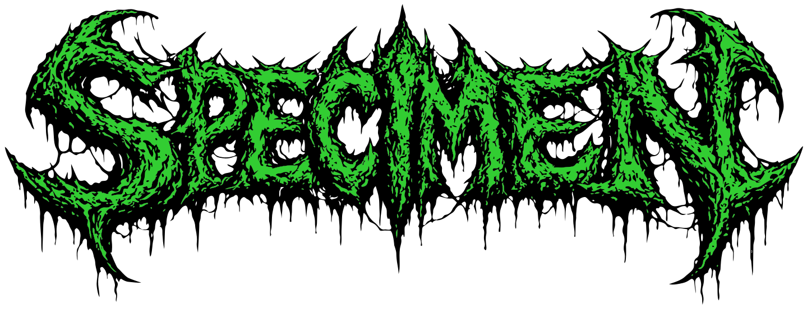

<div align="center">
  
  
  <br/>
  <br/>
  
  **Typography System Compiler for Claude Skills**
  
  [](LICENSE)
  []()
  []()
  
</div>

---

# Specimen

Specimen is a Claude skill that generates structured typography systems from configuration.

## What It Does

- Generates modular type scales using mathematical ratios
- Creates complete typography systems with:
  - Type scale (xs to 6xl with configurable ratios)
  - Font family stacks (primary, secondary, monospace)
  - Font weight scales (100-900)
  - Proportional line heights
  - Letter spacing (tracking)
  - Semantic mappings (h1-h6, body, etc.)
- Exports to CSS variables, Tailwind config, SCSS, or Figma tokens

## Installation

### For Claude Users

Install Specimen from the [Claude Skills marketplace](https://claude.ai):
1. Go to Settings → Skills
2. Search for "Specimen"
3. Click "Add Skill"

See [INSTALLATION.md](INSTALLATION.md) for detailed instructions.

### For Developers

To run locally or integrate into your own projects:

```bash
# Clone the repository
git clone https://github.com/yourusername/specimen-skill.git
cd specimen-skill

# No additional dependencies needed (uses Python stdlib)

# Test the compiler
python -c "from scripts.specimen_compiler import compile_from_config; print(compile_from_config({'base_size': 16, 'ratio': 'minor_third'}))"
```

## Files

- `SKILL.md` - Instructions for Claude on how to use the skill
- `scripts/specimen_compiler.py` - Core type scale generation logic
- `scripts/specimen_exports.py` - Export utilities (CSS, Tailwind, SCSS, Figma)
- `test_specimen.py` - Test script to verify functionality

## Testing

To test the skill:

```bash
python test_specimen.py
```

This will:
- Verify compilation works
- Test all scale ratios
- Test all modes (tight/balanced/loose)
- Verify all export formats
- Test custom font families

## Usage

When a user requests typography system generation:

1. Configure the system parameters
2. Import and run the compiler:
   ```python
   from specimen_compiler import compile_from_config
   result = compile_from_config(config)
   ```
3. Export to desired format:
   ```python
   from specimen_exports import export_css_variables
   css = export_css_variables(result['typography_system'])
   ```
4. Save to `/mnt/user-data/outputs/` and present to user

See `SKILL.md` for complete usage instructions.

## Scale Ratios

Available type scale ratios:
- **minor_second** (1.067) - Very subtle
- **major_second** (1.125) - Subtle
- **minor_third** (1.200) - Balanced (recommended)
- **major_third** (1.250) - Moderate
- **perfect_fourth** (1.333) - Clear distinction
- **augmented_fourth** (1.414) - Strong
- **perfect_fifth** (1.500) - Very strong
- **golden_ratio** (1.618) - Maximum contrast

## Export Formats

### CSS Variables
```css
:root {
  --font-primary: Inter, system-ui, sans-serif;
  --text-base: 1rem;
  --leading-base: 1.5;
}

.h1 {
  font-size: 1.728rem;
  line-height: 1.3;
  letter-spacing: -0.01em;
}
```

### Tailwind Config
```javascript
export default {
  theme: {
    extend: {
      fontFamily: {
        primary: ['Inter', 'system-ui', 'sans-serif'],
      },
      fontSize: {
        'base': ['1rem', { lineHeight: '1.5' }],
      }
    }
  }
};
```

### SCSS Variables
SCSS variables for use in Sass projects.

### Figma Tokens
JSON compatible with Tokens Studio for Figma plugin.

## Integration with Hexed

Specimen pairs perfectly with Hexed to create complete design systems:

```python
# 1. Generate colors with Hexed
color_result = compile_from_images(image_paths)

# 2. Generate typography with Specimen
type_result = compile_from_config(typography_config)

# 3. Combine into unified design system
design_system = {
    'colors': color_result['color_system'],
    'typography': type_result['typography_system']
}
```

## Common Configurations

### SaaS Application
```python
{
    'base_size': 16,
    'ratio': 'minor_third',
    'font_family_primary': 'Inter, system-ui, sans-serif',
    'mode': 'balanced'
}
```

### Marketing Site
```python
{
    'base_size': 18,
    'ratio': 'perfect_fourth',
    'font_family_primary': 'Inter, sans-serif',
    'font_family_secondary': 'Playfair Display, serif',
    'mode': 'loose'
}
```

### Mobile App
```python
{
    'base_size': 16,
    'ratio': 'major_second',
    'font_family_primary': 'system-ui, -apple-system, sans-serif',
    'mode': 'tight'
}
```

## Limitations

- Does not analyze uploaded font files (config-based only)
- Line heights and tracking are algorithmically generated
- Single base size (no responsive scales)
- Font family stacks must be manually specified

## Version

Current version: 0.1.0

## Author

Created by Heathen ([@heathenft](https://x.com/heathenft))

## License

MIT License

Copyright (c) 2026 Heathen

Permission is hereby granted, free of charge, to any person obtaining a copy
of this software and associated documentation files (the "Software"), to deal
in the Software without restriction, including without limitation the rights
to use, copy, modify, merge, publish, distribute, sublicense, and/or sell
copies of the Software, and to permit persons to whom the Software is
furnished to do so, subject to the following conditions:

The above copyright notice and this permission notice shall be included in all
copies or substantial portions of the Software.

THE SOFTWARE IS PROVIDED "AS IS", WITHOUT WARRANTY OF ANY KIND, EXPRESS OR
IMPLIED, INCLUDING BUT NOT LIMITED TO THE WARRANTIES OF MERCHANTABILITY,
FITNESS FOR A PARTICULAR PURPOSE AND NONINFRINGEMENT. IN NO EVENT SHALL THE
AUTHORS OR COPYRIGHT HOLDERS BE LIABLE FOR ANY CLAIM, DAMAGES OR OTHER
LIABILITY, WHETHER IN AN ACTION OF CONTRACT, TORT OR OTHERWISE, ARISING FROM,
OUT OF OR IN CONNECTION WITH THE SOFTWARE OR THE USE OR OTHER DEALINGS IN THE
SOFTWARE.
